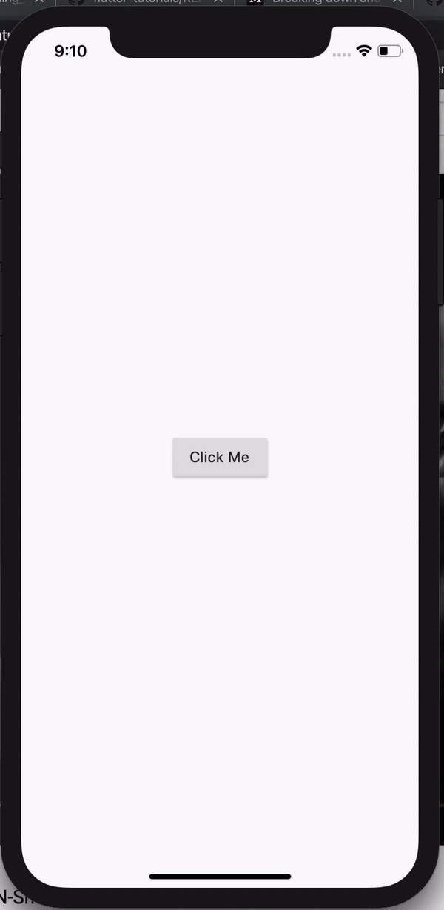

# top_sheet

flutter Top sheet package

## Getting Started

</img>

### installation

install latest version from [Pub](https://pub.dev/packages/top_sheet)

### Usage

```dart
class TopSheetDemo extends StatelessWidget {
  @override
  Widget build(BuildContext context) {
    return Scaffold(
      body: Container(
        child: Center(
          child: RaisedButton(
            child: Text("Click Me"),
            onPressed: () {
              TopSheet.show(
                context: context,
                child: Column(
                  mainAxisSize: MainAxisSize.min,
                  children: <Widget>[
                    ListTile(
                      leading: Icon(Icons.music_note),
                      title: Text('Music'),
                    ),
                    ListTile(
                      leading: Icon(Icons.photo_album),
                      title: Text('Photos'),
                    ),
                    ListTile(
                      leading: Icon(Icons.videocam),
                      title: Text('Video'),
                    ),
                  ],
                ),
                direction: TopSheetDirection.TOP,
              );
            },
          ),
        ),
      ),
    );
  }
}
```

This project is a starting point for a Dart
[package](https://flutter.dev/developing-packages/),
a library module containing code that can be shared easily across
multiple Flutter or Dart projects.

For help getting started with Flutter, view our 
[online documentation](https://flutter.dev/docs), which offers tutorials, 
samples, guidance on mobile development, and a full API reference.

Amazing Package.
